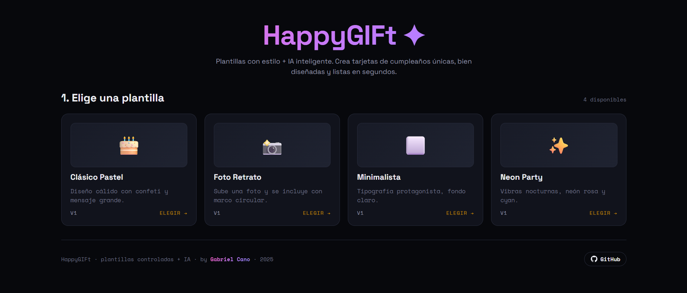
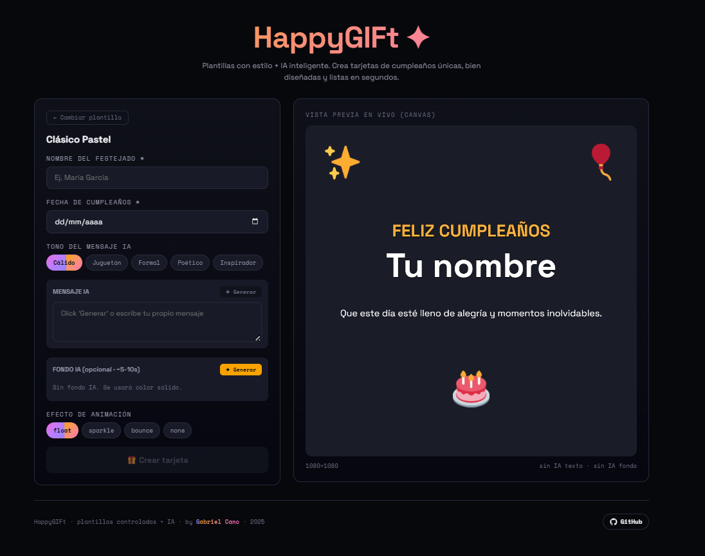
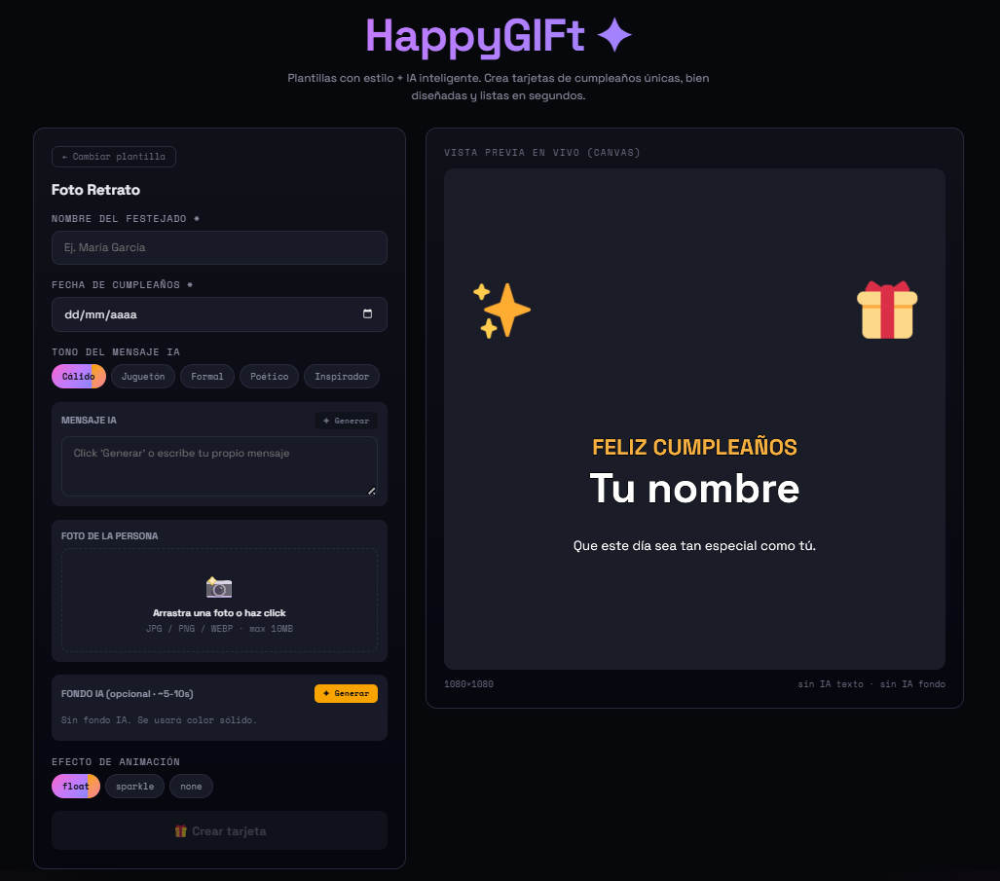
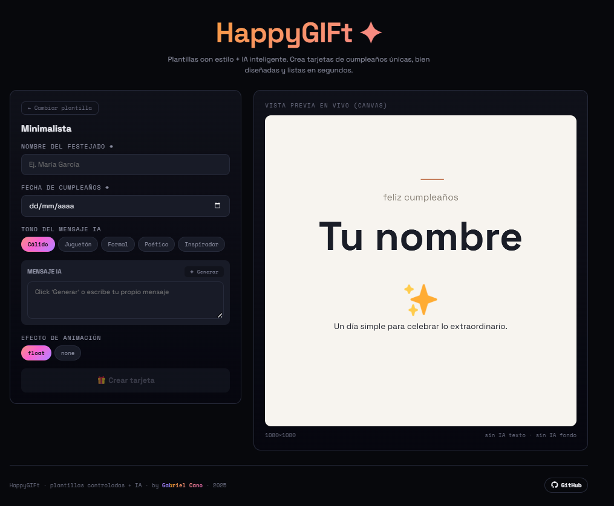
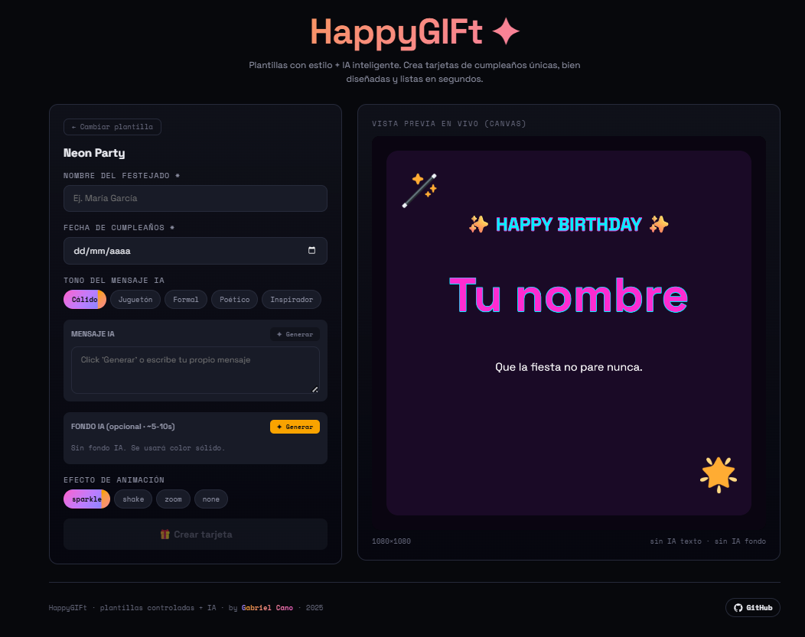

# HappyGIFt — Frontend

Aplicación en React + Vite + TypeScript para crear tarjetas de cumpleaños
animadas. Eliges una plantilla curada, llenas dos campos y la IA rellena los
huecos opcionales (mensaje y fondo). El backend renderiza el GIF y el PNG.

> Backend: [HappyGIFt-Backend](https://github.com/GabrielCano22/HappyGIFt-Backend).

---

## Idea

El usuario nunca ve un prompt. Eso me pareció clave: con plantillas curadas el
resultado es predecible y se puede previsualizar al vuelo en el cliente
mientras escribe. La IA solo aporta:

- el mensaje del centro (texto libre dentro de un tope de caracteres),
- y un fondo abstracto opcional, sin texto ni caras.

Todo lo demás (layout, fuentes, decoraciones, fechas formateadas) sale de la
plantilla.

---

## Stack

| Pieza      | Versión |
| ---------- | ------- |
| React      | 18.x    |
| Vite       | 5.x     |
| TypeScript | 5.x     |

Sin librería de UI: el diseño usa CSS variables + clases utilitarias inspiradas
en [scrollxui.dev](https://scrollxui.dev).

---

## Setup

```bash
git clone https://github.com/GabrielCano22/HappyGIFt.git
cd HappyGIFt
npm install
npm run dev
```

Frontend en `http://localhost:5173/`. Necesita el backend escuchando en
`http://127.0.0.1:8000/api/`. El proxy de Vite ya está configurado.

Para apuntar a otra URL:

```env
# .env.local
VITE_API_BASE=https://api.tudominio.com/api
```

---

## Scripts

| Comando         | Qué hace                            |
| --------------- | ----------------------------------- |
| `npm run dev`   | Servidor de desarrollo (HMR).       |
| `npm run build` | Build de producción a `dist/`.      |
| `npm run preview` | Sirve el build local.             |
| `npx tsc -b`    | Solo typecheck, sin emitir JS.      |

---

## Estructura

```
src/
├── domain/                 tipos compartidos (Template, Card, ...)
├── services/               http, templateService, aiService, renderService
├── features/
│   ├── template-picker/    grid de plantillas
│   ├── card-editor/        formulario + orquestador
│   ├── live-preview/       renderer en canvas (mismo schema que backend)
│   └── result/             pantalla final con descargas
├── components/             ErrorBoundary
├── App.tsx                 shell
├── main.tsx                bootstrap
└── styles.css              tokens + clases utilitarias
```

### Renderer en cliente

`features/live-preview/canvasDraw.ts` lee la plantilla y dibuja directo al
canvas HTML5 — **el mismo schema que usa el backend**. Eso da preview en vivo
sin viajar al servidor en cada keystroke. Los emojis se cargan desde la CDN
de Twemoji para que se vean igual en todos los navegadores.

---

## Decisiones de diseño

- **Plantillas vivas**: cada plantilla declara qué slots son `static`,
  `user_input`, `ai_text`, `ai_background`, `user_photo` o `asset_pack`. Si la
  IA falla, el `fallback` definido en la plantilla salva el render.
- **Sin estado global**: cada feature es autosuficiente. El editor mantiene
  su propio store local; cuando termina, dispara el render y muestra el
  resultado.
- **Cancelable**: las llamadas a IA usan `AbortController`, así que cambiar
  de plantilla o regenerar cancela las peticiones en vuelo.
- **Accesibilidad**: focus ring visible, `prefers-reduced-motion` respetado,
  ARIA labels en botones críticos, soporte de teclado.

---

## Capturas







---

## Licencia

MIT — usar, copiar y modificar.

---

Hecho por [Gabriel Cano](https://github.com/GabrielCano22).
